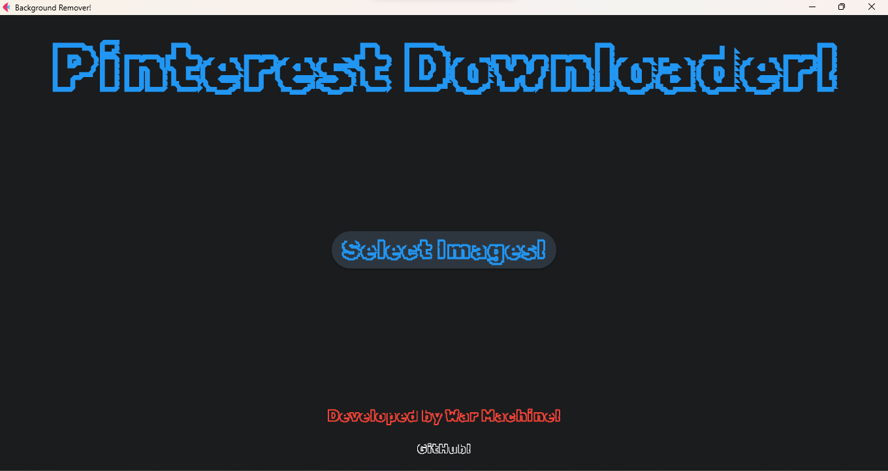

<h1 align="center">Background Remover</h1>

  

<h2 align="center">Installation: </h2>

<h3 align="center">On Windows: </h3>

<h4 align="center">Option 1: </h4>

Install Python 3.10

Install Requeriments: pip install -r requeriments.txt

Execute: python BackgroundRemover.py

<h4 align="center">Option 2: </h4>

Extract the File: BackgroundRemover.zip

Execute: BackgroundRemover.exe

<h4 align="center">Option 3: </h4>

Install With: BackgroundRemoverSetup.exe
